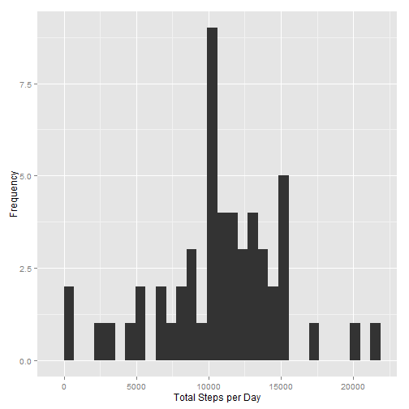
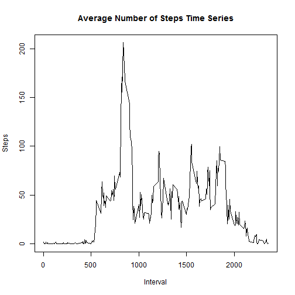
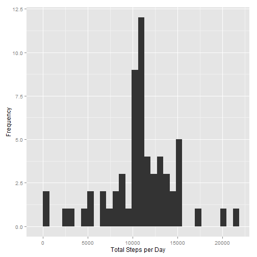
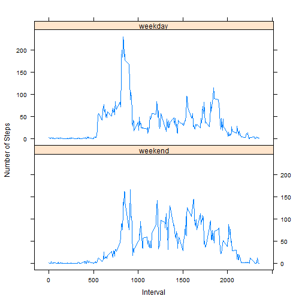

Reproducible Data Assignment 1 
========================================================
## Loading and preprocessing the data

- Load the Data


```r
#Obtain the data
fileURL<-"http://d396qusza40orc.cloudfront.net/repdata%2Fdata%2Factivity.zip"
download.file(fileURL, destfile = "activity.zip")
unlink(fileURL)
unzip("activity.zip")
activity <- read.csv("activity.csv")
```

- Process/transform the data


```r
#Transform the data.  Take this question to mean a histogram of steps/day and the count of that data as opposed to providing the 
#number of steps taken on the y axis and date on the x axis

a_sum<-aggregate(steps~date, data=activity, FUN=sum, na.rm=TRUE)
```

## What is mean total number of steps taken per day?

- Make a histogram of the total number of steps taken each day


```r
#Make a histogram
library(ggplot2)
#Binwdith calculation
bw<-max(a_sum$steps)

ggplot(a_sum, aes(x=steps)) + geom_histogram(binwidth=bw/30) +xlab("Total Steps per Day") +ylab("Frequency")
```

 

- Calculate and report the mean and median total number of steps taken per day


```r
#Calculate the daily mean and median
meanstep<-as.integer(mean(a_sum$steps))
medianstep<-as.integer(median(a_sum$steps))
print(meanstep)
```

```
## [1] 10766
```

```r
print(medianstep)
```

```
## [1] 10765
```

The mean number of steps is 10766 and the median number of steps is 10765.

## What is the average daily activity pattern?

- Make a time series plot (i.e. type = "l") of the 5-minute interval (x-axis) and the average number of steps taken, averaged across all days (y-axis)


```r
#Make a time series plot
a_interval<-aggregate(steps~interval, data=activity, FUN=mean, na.rm=TRUE)
plot(a_interval$interval, a_interval$steps, xlab="Interval", ylab="Steps", type="l", main="Average Number of Steps Time Series")
```

 

- Which 5-minute interval, on average across all the days in the data set, contains the maximum number of steps?


```r
#Identify the max average of steps and determine which interval that represents

datsorted=a_interval[order((a_interval$steps), decreasing=TRUE),]
maxstep<-datsorted[1,]
print(maxstep)
```

```
##     interval steps
## 104      835 206.2
```

```r
maxint<-maxstep[1,1]
maxstep2<-maxstep[1,2]
```

Interval 835 has the highest average number of steps at 206.1698 steps.


## Imputing missing values

- Calculate and report the total number of missing values in the data set (i.e. the total number of rows with NAs)


```r
#Determine how many records have NA data


bad<-subset(activity, is.na(activity$steps))
missing<-nrow(bad)
print(missing)
```

```
## [1] 2304
```

There are 2304 missing values in the dataset.


- Devise a strategy for filling in all of the missing values in the dataset.

Will use the interval average for any missing NA data.


- Create a new dataset that is equal to the original dataset but with the missing data filled in.


```r
act2<-activity

act2$steps<-replace(act2$steps,is.na(act2$steps),a_interval$steps[match(act2$interval,a_interval$interval)])
```

```
## Warning: number of items to replace is not a multiple of replacement
## length
```

- Make a histogram of the total number of steps taken each day and Calculate and report the mean and median total number of steps taken per day. Do these values differ from the estimates from the first part of the assignment? What is the impact of imputing missing data on the estimates of the total daily number of steps?


```r
#Make a histogramn

a2_sum<-aggregate(steps~date, data=act2, FUN=sum, na.rm=TRUE)

#Make a histogram
library(ggplot2)
#Binwdith calculation
bw2<-max(a2_sum$steps)

ggplot(a2_sum, aes(x=steps)) + geom_histogram(binwidth=bw2/30) +xlab("Total Steps per Day") +ylab("Frequency")
```

 

```r
#Transform the data 
#Assumes only NA data will be replaced, not 0 values

a_sum2<-aggregate(steps~date, data=act2, FUN=sum, na.rm=TRUE)

#Calculate and report the mean and median total number of steps taken per day

meanstep2<-as.integer(mean(a_sum2$steps))
medianstep2<-as.integer(median(a_sum2$steps))
print(meanstep2)
```

```
## [1] 10766
```

```r
print(medianstep2)
```

```
## [1] 10766
```


By imputing the missing data using this method, the median is 10766 and the mean is 10766.  As a result, the median and mean are equal.  The process of imputing data did not change the mean since mean data was used to account for NA information.  The median only increased slightly, from 10765 to 10766 after imputing missing data. 


## Are there differences in activity patterns between weekdays and weekends?

- Create a new factor variable in the dataset with two levels - "weekday" and "weekend" indicating whether a given date is a weekday or weekend day.


```r
#Add a new column to the data set with the value of weekday or weekend
#Start with day of week

act2$dayofweek<-weekdays(as.Date(act2$date))

days<-unique(act2$dayofweek)
mat=matrix(c("Monday","Tuesday","Wednesday","Thursday","Friday","Saturday","Sunday", "weekday","weekday","weekday","weekday","weekday","weekend","weekend"), nrow=7, ncol=2)

colnames(mat)<-c("day","group")


act2$dayofweek<-mat[,2][match(act2$dayofweek, mat[,1])]
```


- Make a panel plot containing a time series plot (i.e. type = "l") of the 5-minute interval (x-axis) and the average number of steps taken, averaged across all weekday days or weekend days (y-axis)


```r
#Summarize the data
wkdaysub<-subset(act2, act2$dayofweek=="weekday")
wkendsub<-subset(act2, act2$dayofweek=="weekend")

wkd<-aggregate(steps~interval, data=wkdaysub, FUN=mean, na.rm=TRUE)
wke<-aggregate(steps~interval, data=wkendsub, FUN=mean, na.rm=TRUE)

wkd$day<-"weekday"
wke$day<-"weekend"

mergeddata=merge(wkd,wke, all=TRUE)

#Plot the data
require("lattice")
```

```
## Loading required package: lattice
```

```r
xyplot(steps ~ interval | day, mergeddata, layout = c(1, 2), ylab = "Number of Steps", 
       xlab = "Interval", type="l",as.table = T)
```

 

There are differences comparing weekend to weekday.  It appears that the weekday data has more activity in early intervals perhaps because people are sleeping in later on the weekends.  After interval 1000, weekday activity drops dramatically and remains at a low level presumably because people are going to work and sitting down at their jobs, but on the weekends, there is a more pronounced level of activity throughout the day.
